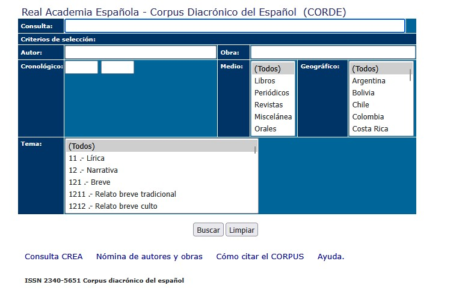
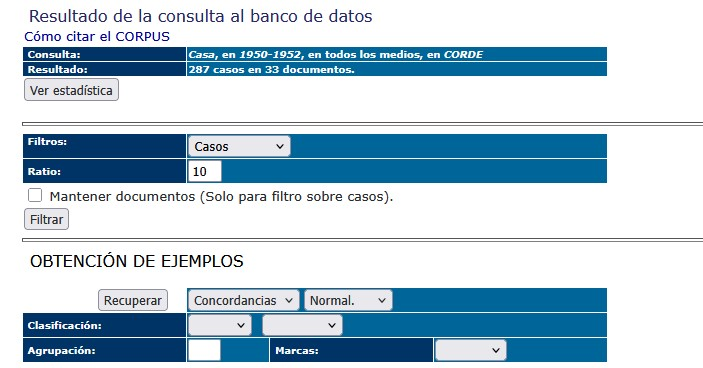

# Descarga de concordancias del CORDE

## Requisitos previos

A la hora de interactuar con esta CLI debemos tener muy claro el navegador con el que queremos trabajar. Actualmente, el CLI está configurado para soportar 3 navegadores:

- Chrome
- Firefox
- Edge (?)

Por lo tanto, dichos navegadores deben estar instalados en nuestro entorno.

Además, necesitaremos un intérprete de python instalado es recomendable utilizar una versión igual o superior a la `3.11`.

Una vez que tengamos nuestro intérprete ejecutaremos el siguiente código para instalar los paquetes necesarios:

```bash
# Es importante que estemos situados en este directorio (el que contiene los scripts)
pip install -r requirements.txt
```

## Manejo y uso

Una vez que hayamos configurado el entorno la forma más fácil de empezar a trabajar es la siguiente:

```bash
python corde_scraper.py -b firefox -t concord -v
```

Las opciones:

- `b` : el navegador (firefox, chrome o edge)
- `t` : el tipo de acción. Actualmente solo está soportada la extracción de concordancias
- `v`: para loggear los eventos del script

Una vez ejecutado, aparecerá la ventana del navegador con la página del CORDE. Primero rellenamos nuestro perfil de búsqueda:



Y después seleccionamos los resultados que queremos obtener:


Tenemos un total de 5 MINUTOS como máximo para ejecutar estas dos acciones: el script dará error pasado ese tiempo.
Una vez demos click a `Recuperar` el script empezará a leer cada registro de cada página para guardar los resultados obtenidos en un archivo excel (aunque podemos modificar el comando anterior para guardarlos en excel).
